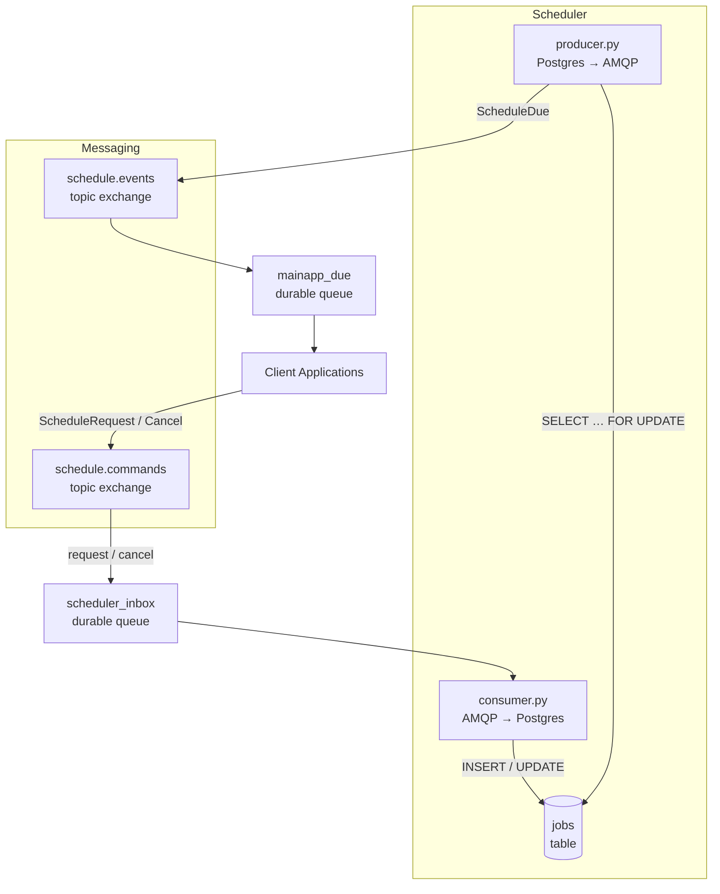
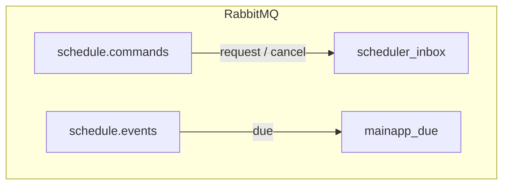
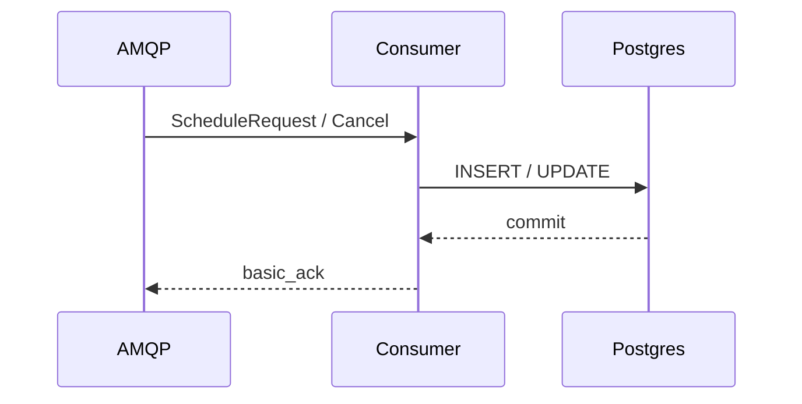
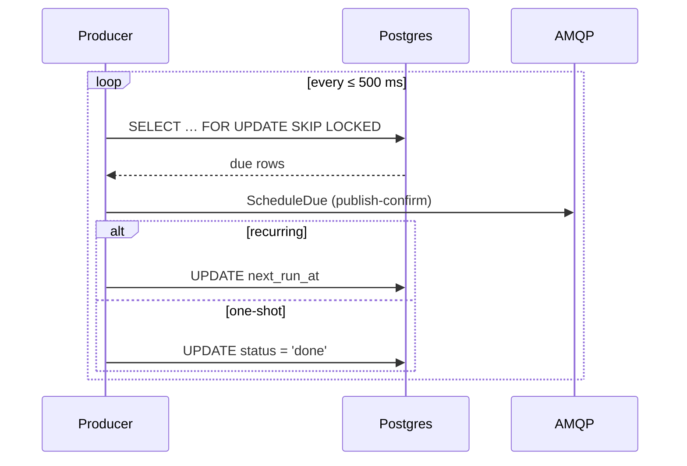

# Scheduler Service – Architecture Overview
*A lightweight, RabbitMQ-driven reminder engine that plugs into your monolith.*

---

## 1  High-Level Picture



---

## 2  Core Components

| ID              | Component                                                                            | Role                       | Image |
| --------------- | ------------------------------------------------------------------------------------ | -------------------------- | ----- |
| **Main App**    | Publishes `ScheduleRequest` & `ScheduleCancel`; consumes `ScheduleDue`.              | -                          |       |
| **RabbitMQ**    | Topic exchanges, durable queues, DLQ, publisher confirms.                            | `rabbitmq:3.13-management` |       |
| **PostgreSQL**  | Persists job state; supports horizontal workers via `FOR UPDATE SKIP LOCKED`.        | `postgres:16`              |       |
| **consumer.py** | Validates & inserts/cancels jobs.                                                    | `scheduler:latest`         |       |
| **producer.py** | Every ≤ 500 ms selects due rows, emits `ScheduleDue`, reschedules or completes them. | `scheduler:latest`         |       |
| **Prometheus**  | Scrapes `/metrics` from consumer & producer.                                         | `prom/prometheus:v2`       |       |
| **Grafana**     | Dashboards for job throughput & lag.                                                 | `grafana/grafana:10`       |       |

---

## 3  Database Schema

```sql
CREATE TYPE job_status AS ENUM ('pending','done','cancelled');

CREATE TABLE jobs (
    id          UUID PRIMARY KEY,
    job_type    TEXT      NOT NULL,
    payload     JSONB     NOT NULL,
    rrule       TEXT,
    next_run_at TIMESTAMPTZ NOT NULL,
    retries     INT       DEFAULT 0,
    status      job_status DEFAULT 'pending',
    created_at  TIMESTAMPTZ DEFAULT now()
);

CREATE INDEX jobs_pending_idx
  ON jobs (status, next_run_at)
  WHERE status = 'pending';
```

---

## 4  RabbitMQ Topology



*Both exchanges are `topic` type; routing-keys are kept flat (`request`, `cancel`, `due`).*

---

## 5  Runtime Processes

### consumer.py



### producer.py



---

## 6  Observability (Fast-lane)

* **Endpoints** – each process exposes Prometheus metrics on `:8000/metrics`
  Counters: `jobs_queued_total`, `jobs_cancelled_total`, `jobs_due_total`
* **Prometheus** scrapes consumer & producer containers every 15 s.
* **Grafana** auto-detects Prometheus and ships with ready-made dashboards.

---

## 7  Scalability & Fault-Tolerance

| Aspect             | Mechanism                                                                                             |
| ------------------ | ----------------------------------------------------------------------------------------------------- |
| Horizontal scaling | Run *N* `producer` replicas; `SKIP LOCKED` prevents double-work.                                      |
| Crash safety       | If the producer dies after publishing but before DB update ⇒ duplicate `ScheduleDue` (at-least-once). |
| Clock skew         | Scheduler is single source of truth; producer uses DB time comparison.                                |
| Back-pressure      | RabbitMQ flow-controls per channel; `prefetch` keeps consumer memory bounded.                         |

---

### Next Doc

The next markdown file will describe **runtime flows** (one-shot, recurring, cancel path, failure path).
Let me know when you’re ready and we’ll generate that file, too.

