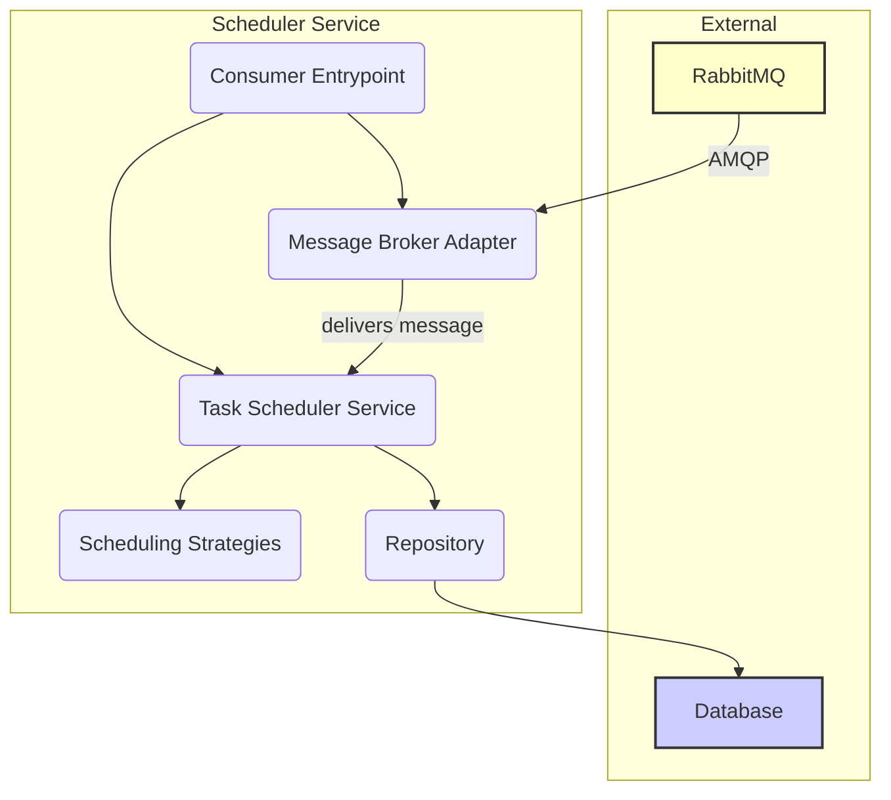

# Architecture Overview

The Scheduler Service is designed with a layered architecture that separates concerns, making it easier to maintain and extend. The primary components work together to consume, process, and store task scheduling requests.

## Components

*   **Consumer (`consumer.py`)**: The main entrypoint of the service. It initializes and runs the core application logic.
*   **Adapters (`adapters/`)**: Handles communication with external systems.
    *   `message_broker.py`: Connects to RabbitMQ, manages the connection, and registers callbacks for incoming messages.
    *   `database.py`: Defines the database schema and provides SQLAlchemy engines for database connectivity.
*   **Scheduler (`scheduler/`)**: Contains the core domain logic.
    *   `services.py`: The `TaskScheduler` class orchestrates the process of consuming, calculating, and saving tasks.
    *   `repository.py`: The `TaskRepo` provides a data access layer, abstracting database operations.
    *   `strategies/`: A set of classes for calculating the `next_run_time` of a task based on its repeat period.
    *   `models.py` & `dto.py`: Pydantic models for data validation and structuring.
*   **Configuration (`config.py`)**: Manages application settings using environment variables.

## Component Diagram

The following diagram illustrates how the major components interact:

```mermaid
graph TD
    subgraph External
        A[RabbitMQ]
        B[Database]
    end

    subgraph Scheduler Service
        C(Consumer Entrypoint) --> D(Message Broker Adapter)
        C --> E(Task Scheduler Service)
        D -- delivers message --> E
        E --> F(Scheduling Strategies)
        E --> G(Repository)
        G --> B
    end

    A -- AMQP --> D

    style A fill:#ffc,stroke:#333,stroke-width:2px
    style B fill:#ccf,stroke:#333,stroke-width:2px
```

This decoupled design allows for components like the message broker or database to be swapped with different implementations by creating new adapters.

