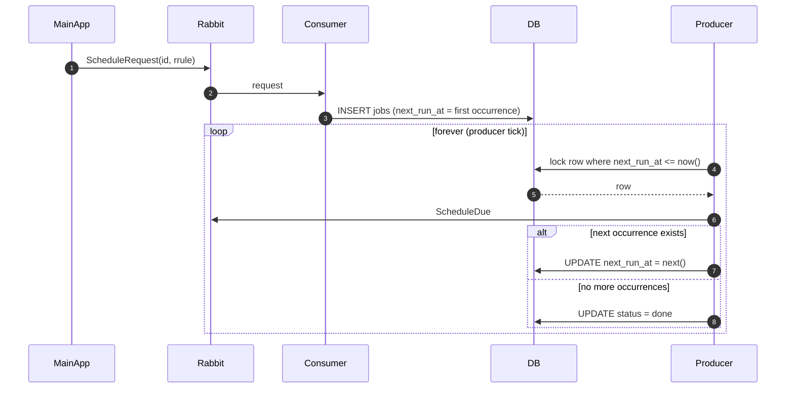
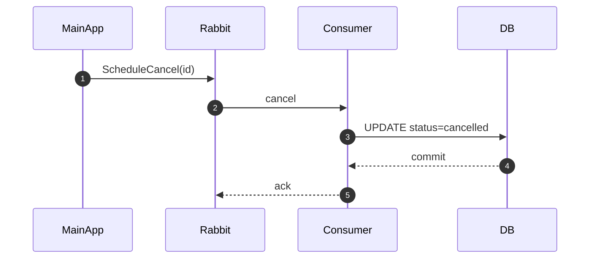
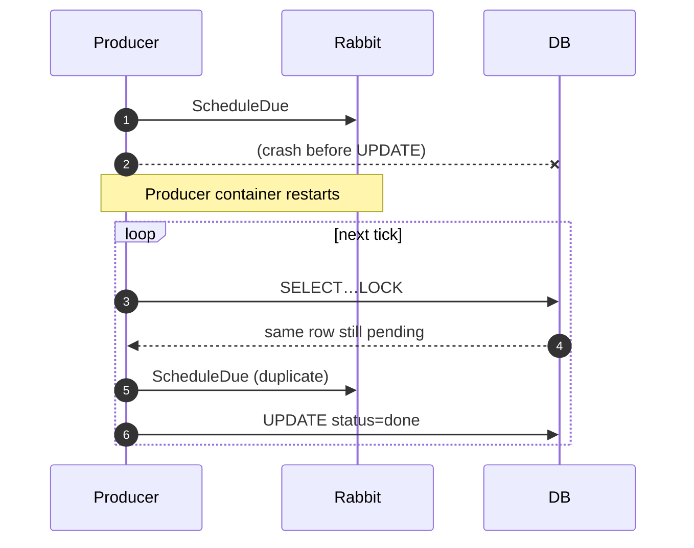
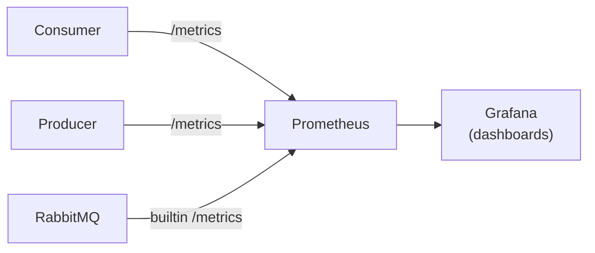

# Runtime Flows

This file zooms in on **how a single reminder travels** through the system in four common scenarios:

1. One-shot schedule  
2. Recurring schedule (RRULE)  
3. Cancellation  
4. Failure & retry  

Each flow is illustrated with a Mermaid sequence diagram that MkDocs / mkdocstrings will render automatically.

---

## 1  One-Shot Schedule

> “Run this task **once** at exactly `2025-07-10 09 00 UTC`.”

```mermaid
sequenceDiagram
    autonumber
    participant MainApp as Main&nbsp;App
    participant Rabbit as RabbitMQ
    participant Consumer
    participant DB as Postgres
    participant Producer
    Note over MainApp: 1 – Publish ScheduleRequest
    MainApp->>Rabbit: ScheduleRequest(id, at)
    Rabbit->>Consumer: request
    Consumer->>DB: INSERT jobs
    DB-->>Consumer: commit
    Consumer-->>Rabbit: ack

    Note over Producer,DB: Every ≤500 ms
    Producer->>DB: SELECT…FOR UPDATE (due rows)
    DB-->>Producer: job row
    Producer->>Rabbit: ScheduleDue(id, fired_at)
    Rabbit-->>MainApp: ScheduleDue
    Producer->>DB: UPDATE status=done
    DB-->>Producer: commit
```

**Key points**

* No status change happens until the due event is successfully published.
* Exactly one producer handles the row thanks to `SKIP LOCKED`.

---

## 2  Recurring Schedule (RRULE)

> “Run this task **every day at 09 00 UTC**.”




**Rescheduling happens in-place**; the row’s primary key (`id`) never changes, keeping deduplication simple.

---

## 3  Cancellation

> User decides a reminder is no longer needed.



Rows marked `cancelled` are **ignored** by the producer query (`WHERE status = 'pending'`).
If the row was locked by a producer at the exact moment of cancellation, the `UPDATE` will block until the producer finishes; subsequent cycles will skip it.

---

## 4  Failure & Retry (at-least-once)

> What if the producer crashes **after** publishing `ScheduleDue` but **before** updating the row?



Main App must treat `ScheduleDue` messages **idempotently** (e.g., ignore if it has already processed `id`).
This simple strategy lets us avoid transactional outbox complexity while guaranteeing no missed fires.

---

## 5  Monitoring Flow



Counters updated in code:

| Metric name            | Incremented when…                  |
| ---------------------- | ---------------------------------- |
| `jobs_queued_total`    | consumer inserts a new job         |
| `jobs_cancelled_total` | consumer cancels a job             |
| `jobs_due_total`       | producer publishes a `ScheduleDue` |

These three numbers are enough to chart throughput, backlog, and error spikes within minutes of deployment.

---

## 6  Lifecycle Summary

| State         | Entered by                             | Exited by                                                          |
| ------------- | -------------------------------------- | ------------------------------------------------------------------ |
| **pending**   | ScheduleRequest accepted               | emitted (→ `done` or rescheduled) • ScheduleCancel (→ `cancelled`) |
| **done**      | One-shot fired, or recurring completed | never leaves                                                       |
| **cancelled** | ScheduleCancel                         | never leaves                                                       |

No extra “due” state is needed—the row is simply locked while due.


