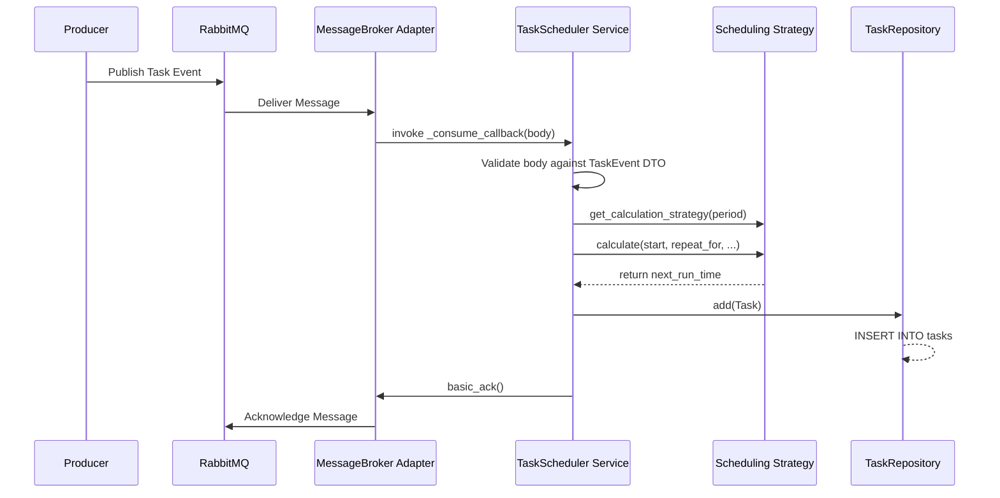

# Data Flow

The primary flow of the service involves consuming an event from RabbitMQ, processing it, and persisting it as a scheduled task in the database.

## Event Consumption Flow

When a message is published to the configured RabbitMQ exchange and routing key, the service performs the following steps:

1.  **Ingestion**: The `RabbitMQ` adapter in `adapters.message_broker` receives the message.
2.  **Callback**: It invokes the `_consume_callback` method within the `TaskScheduler` service.
3.  **Validation**: The incoming JSON message body is decoded and validated against the `scheduler.dto.TaskEvent` Pydantic model.
4.  **Strategy Selection**: Based on the `period` field in the event, a corresponding time calculation strategy is retrieved from `scheduler.strategies`.
5.  **Calculation**: The selected strategy's `calculate()` method is called to determine the `next_run_time` for the task.
6.  **Persistence**: A `scheduler.models.Task` object is created and passed to the `TaskRepo` to be inserted into the database.
7.  **Acknowledgement**: The message is acknowledged with RabbitMQ to remove it from the queue.

## Sequence Diagram

```mermaid
sequenceDiagram
    participant P as Producer
    participant R as RabbitMQ
    participant M as MessageBroker Adapter
    participant S as TaskScheduler Service
    participant T as Scheduling Strategy
    participant D as TaskRepository

    P->>R: Publish Task Event
    R->>M: Deliver Message
    M->>S: invoke _consume_callback(body)
    S->>S: Validate body against TaskEvent DTO
    S->>T: get_calculation_strategy(period)
    S->>T: calculate(start, repeat_for, ...)
    T-->>S: return next_run_time
    S->>D: add(Task)
    D-->>D: INSERT INTO tasks
    S->>M: basic_ack()
    M->>R: Acknowledge Message
```

!!! warning "Error Handling"
    If JSON decoding or Pydantic validation fails, the service logs a warning and acknowledges the message to prevent it from being re-queued indefinitely. See [Troubleshooting](troubleshooting.md) for more details.

